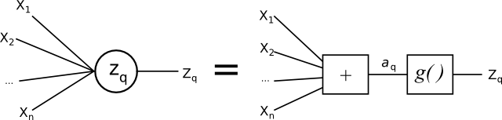

Artificial Neural Network
=========================

This section gives an introduction to the Artificial Neural Network implemented in PyPR.
The implmented ANN supports several network outputs and efficient evaluation of the error gradient using backpropagation.

An Artificial Neural Network can map serval inputs to several outputs

.. math::
    \textbf{y} =  f \left ( \textbf{x} ; \textbf{w} \right )

where :math:`\textbf{x}` and :math:`\textbf{y}` are a vectors with inputs and output values respectivily.
The function :math:`f` is consistst of mathematical function for the neural network, which can be controlled by a set of parmeters :math:`\textbf{w}`.
In the context of ANN these parameters are most commonly called *weights*.
The weight can be adjusted to get the desired mapping from :math:`\textbf{x}`, this process is called the *training* of the network.

Network Structure and Evaluation
--------------------------------

The feedforward network structure supported by the PyPR.

.. _feedforwardnetwork:

.. figure:: figures/feedforwardnetwork2.*
    :align: center

    A 2-layer feedforward artifical neural network.

The figure  :ref:`2 layer feedforward ANN<feedforwardnetwork>` shows a typical 2-layer feedforward artifical neural network.
On the left side of the network the inputs are given, and on the right the outputs.
The network is called a *feed forward* because the data only moves in one direction; from the input towards the outputs.
The nodes drawn as circles are called *perceptrons*. 
They sum all their inputs, and apply a activtion function. The perceptrons will be investigated shortly.
The figure  :ref:`2 layer feedforward ANN<feedforwardnetwork>` is for a two layer network, but the network can consist of fewer of more layers.
The 2-layer network will be used here for explaining the basic concepts of the ANN.
A bias node is also located together with the inputs, and is supplied by the network itself.
It always gives a value of one, and helps the network handle zero only inputs better.

The lines denote the adjustable weights :math:`\textbf{w}`.
A weight matrix is given for each layer. A layer's weight matrix is identified by a superscript number :math:`(k)`, :math:`\textbf{w}^{(k)}`, where :math:`k` is the layer number.
Each element in the weight matrix :math:`\textbf{w}^{(k)}` is denoted :math:`w^{(k)}_{ij}`, which is the weight value for the connection from node :math:`j` to node :math:`i`.

To find the an output of the network, the inputs are passed forward through the network.
Let us first find the outputs of the first layer of perceptrons.
A more detailed drawing of the node or perceptron :math:`z_q` could look like this:

.. _perceptron:

    A perceptron.

The total input to the perceptron :math:`z_q` is given by

.. math::
    a_q = \sum_{i=1}^N w_{qi}^{(1)} x_i + w_{j0}^{(1)}

where :math:`w_{j0}` is the weight that has been assigned the bias unit.
If we also assign :math:`x_0 = 1`, the equation can be simplified to

.. math::
    a_q = \sum_{i=0}^N w_{qi}^{(1)} x_i

The output of the hidden perceptron :math:`z_q` is found by applying its *activation function*,  :math:`g^{(1)}(\cdot)`, to the nodes total input, :math:`a_q`:

.. math::
    z_q = g^{(1)}(a_q)

The second layer of perceptrons is handled in a similar manner, and the output from the network can be written as

.. math::
    y_m = g^{(2)} \left( \sum_{q=0}^Q w_{mq}^{(2)} z_q \right )

By inserting the expression for :math:`z_q` we get the full expression for a 2-layer ANN

.. math::
    y_m = g^{(2)} \left( \sum_{q=0}^Q w_{mq}^{(2)} g^{(1)} \left (
    \sum_{i=0}^N w_{qi}^{(1)} x_i
    \right ) \right )

About the activation function.

.. _af:

.. figure:: figurecode/af.*
    :align: center

In the ANN implementation there is a matrix for each layer with the weights.
The last column in the weight matrix gives the weights assigned to the bias node from the previous layer.

Examining the Weight Matrix Structure
^^^^^^^^^^^^^^^^^^^^^^^^^^^^^^^^^^^^^

The weight matrices used in PyPR have the bias weights added as the last column.

Here is an example of createing a ANN with PyPR::

    >>> import pypr.ann as ann
    >>> nn = ann.ANN([1,3,1]) # A network with 1 inputs, 3 hidden nodes, and 1 output
    >>> nn.weights[0] # First layer of weights W^(1)
    array([[ 2.45579029, -2.22287964],
           [-1.75201183,  0.05098648],
           [ 0.95317093,  0.84703608]])
    >>> nn.weights[1] # Second layer of weights W^(2)
    array([[-0.54627072, -0.67273706,  1.42473486, -0.21274268]])

The create ANN has 1 input, 3 hidden nodes, and 1 output.
The example show how to obtain the weight matrices.
The first matrix is 3x2. The first column is for the input, and the last for the bias node.
The rows give the weight to each unit in the hidden layer next.

The second weight matrix is 1x4. All the outputs from the hidden layer go to 1 output perceptron.
The last column here again is due to the bias node.

Training
--------

The NN need data to be trained. For this purpose the is a
special container class, which handles the joins the training data and the
NN.

Purpose of error function

Activation and Error Functions
------------------------------

The activation functions are implemented in ``pypr.ann.activation_functions``.
The are implemented as 2-tuples. The first element is a reference to the activation
function, and the second a reference to its derivative with regard to the input value.

+------------------------+---------------------------+---------------------------+
| Name                   | Function                  | Derivative                |
|                        |                           |                           |
+========================+===========================+===========================+
| Linear                 | :math:`x`                 | :math:`1`                 |
+------------------------+---------------------------+---------------------------+
| Sigmoid                | :math:`1 / (1 + exp(-x))` | :math:`g(x) * (1 - g(x))` | 
+------------------------+---------------------------+---------------------------+
| Tanh                   | :math:`tanh(x)`           | :math:`1-g(x)^2`          |
+------------------------+---------------------------+---------------------------+

The value passed to derivative method is actually :math:`g(x)`, and not :math:`x`.
One should only be aware of this, if implementing new activation functions.

Here is a toy example where we assign all three activation functions::

    import pypr.ann as ann
    import pypr.ann.activation_functions as af
    nn = ann.WeightDecayANN([1,1,1,1], [af.tanh, af.sigmoid, af.lin]))

TODO: Selecting activation and error functions.

Classification
--------------

A neural network can be trained to find the posterior probabilities, which reflects the uncertainty that a sample belongs to a given set of classes.
A general case of classification, is when the observations have to be classified into :math:`K` classes.
The ANN will have :math:`K` outputs, one for each class.
If the observation belongs to a class :math:`k` the corresponding output number will be 1, otherwise the outputs are 0.
This is called a 1-of-K binary coding scheme.

If the output of the network should be considered as probabilities, they have to fulfill some requirements, which are :math:`0 \le y_k \le 1` and
:math:`\sum_k y_k=1`.

This can be achieved using the softmax activation function

.. math::
    y_k = \frac{\exp (a_k)}{\sum_{k'} \exp (a_{k'})}

According to [bishop95]_ the conditional distribution for this setup can be written as

.. math::
    p( \mathbf{t}^n | \mathbf{x}^n) = \prod_{k=1}^c \left ( y_k^n \right ) ^ {t_k^n}

and the negative log likelihood function of the cross entropy can be expressed as

.. math::
    E_{ce} = - \sum_n \sum_{k=1}^c t_k^n \ln y_k^n

.. ATTENTION::
    The entropic cost function and softmax activation function must be used together due to the implementation.
    If the entropic cost function is used, then the softmax activation function must be used on the output layer.
    And the softmax activation function can only be used in this layer.

:ref:`iris_example` gives a classification example of the well-known Iris dataset using the softmax activation function and cross entropy error function.

Implementation overview
-----------------------

The ANN is implemented in a class called ``ANN`` and extended by ``WeightDecayANN``, which adds weight decay support.
This is done by modifying the gradient and error functions accordingly.

The ANN class can flatten the weights in all the layer into a vector.
This is handy, because then general purpose function minimization can be used for training the ANN. 

.. [elliott] Technical Research Report, A Better Activation Function for Artificial Neural Networks, D.L. Elliott, University of Maryland, 1993

.. [bishop95] Neural Networks for Pattern Recognition, Christopher M. Bishop, Oxford University Press, 1995

.. [bishop06] Pattern Recognition and Machine Learning, Christopher M. Bishop, Springer, 2006

Application Programming Interface
^^^^^^^^^^^^^^^^^^^^^^^^^^^^^^^^^

.. automodule:: pypr.ann.ann
   :members:

Activation functions
""""""""""""""""""""

.. automodule:: pypr.ann.activation_functions
   :members:

Error functions
"""""""""""""""

.. automodule:: pypr.ann.error_functions
   :members:

