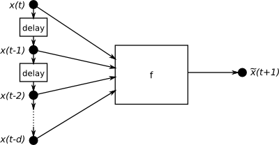

More Examples
=============

Tapped Delay Neural Network - Sunspot example
---------------------------------------------

.. 
    Definition of time series

A time serie is a sequence of vectors, :math:`\mathbf{x}` that depend on time :math:`t`.

.. math::
    \left (
    \mathbf{x}(t_0), \mathbf{x}(t_1), ..., \mathbf{x}(t_i), ... \mathbf{x}(t_N)  
    \right )

The time series could also consist of a sequence of scalars :math:`x`.

This example based upon an exercise 4 from a IMM, DTU course on signal processing [imm02457]_.
The examples is located in PyPR's examples folder, in a subfolder called sunspots.

.. literalinclude:: ../../examples/sunspots/sunspots1.py

The example should generate a plot similar similar to this:

.. image:: figures/sunspots.*

And a plot with the sample autocorrelation of the fitted models residuals.

.. image:: figures/sunspots-sac-residiuals.*

.. [imm02457] 02457 Nonlinear Signal Processing, http://cogsys.imm.dtu.dk/teaching/04364/04364prac.html

Gaussian Mixture Model Regression (GMR) - Sunspot example
---------------------------------------------------------

.. literalinclude:: ../../examples/sunspots/sunspots_gmm.py

.. _bicexample:

Finding the Number of Clusters to use in a Gaussian Mixture Model
-----------------------------------------------------------------

.. literalinclude:: ../../examples/em_gm_with_cross_validation_and_bic.py

.. image:: figures/bic.*

Simple GP demo
--------------
In the examples folder you can find a program called 'gp_hyperparameters_demo.py' where the effects of the GP's hyperparameters are illustrated.

.. image:: figures/gp_example.*

.. _iris_example:

Multiclass classification using ANN
-----------------------------------

.. literalinclude:: ../../examples/iris.py

When runned the program will generate an output similar to this::

    >>> execfile('iris.py')
    Correct predictions = 150
    Incorrect predictions = 0

