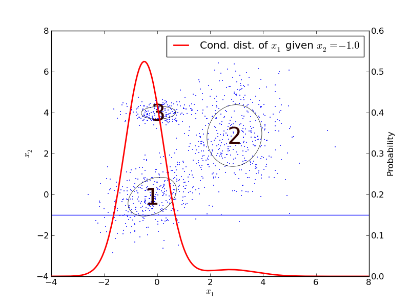

Gaussian Mixture Models
-----------------------

A multivariate normal distribution or multivariate Gaussian distribution is a generalization of the one-dimensional
Gaussian distribution into muliple dimensions.

.. math::
     \mathcal{N}(\mathbf{x}|\mathbf{\boldsymbol\mu}, \mathbf{\Sigma}) =
    \frac{1}{(2 \pi)^{D/2}}
    \frac{1}{ | \mathbf{\Sigma} |^{1/2} }
    \exp \{ -\frac{1}{2} (\mathbf{\mathbf{x}}-\mathbf{\boldsymbol\mu)}^T \mathbf{\Sigma}^{-1} (\mathbf{\mathbf{x}}-\mathbf{\boldsymbol\mu)} \}

The distribution is given by its mean, :math:`\mathbf{\boldsymbol\mu}`, and covariance, :math:`\mathbf{\Sigma}`, matrices.
To generate samples from the multivariate normal distribution under python, one could use the 
`numpy.random.multivariate_normal <http://docs.scipy.org/doc/numpy/reference/generated/numpy.random.multivariate_normal.html>`_ function from numpy.

In statistics, a mixture model is a probabilistic model for density estimation using a mixture distribution. A mixture model can be regarded as a type of unsupervised learning or clustering [wikimixmodel]_.
Mixture models provide a method of describing more complex propability distributions, by combining several probability distributions.
Mixture models can also be used to cluster data.

The Gaussian mixture distribution is given by the following equation [bishop2006]_:

.. math::
    p(\mathbf{x}) = \sum_{k=1}^{K} \pi_k \mathcal{N} (\mathbf{x} | \boldsymbol\mu_k, \mathbf{\Sigma}_k)

Here we have a linear mixture of Gaussian density functions, :math:`\mathcal{N} (\mathbf{x} | \boldsymbol\mu_k, \mathbf{\Sigma}_k)`.
The parameters :math:`\pi_k` are called mixing coefficients, which must fulfill

.. math::
    \sum_{k=1}^K \pi_k = 1

and given :math:`\mathcal{N} (\mathbf{x} | \boldsymbol\mu_k, \mathbf{\Sigma}_k) \geq 0$ and $p(\mathbf{x}) \geq 0` we also have that

.. math::
    0 \geq \pi_k \geq 1

Sampling and Probability Density Function
^^^^^^^^^^^^^^^^^^^^^^^^^^^^^^^^^^^^^^^^^

PyPR has some simple support for sampling from Gaussian Mixture Models.

.. automodule:: pypr.clustering.gmm
   :members: sample_gaussian_mixture

The example *sample_gmm* gives an example of drawing samples from a mixture of three clusters, and plotting the result.

.. literalinclude:: ../../examples/sample_gmm.py

The resulting plot should look something like this:

.. image:: figures/sample_gmm.*

..
    Other probability distributions can be used instead of the Gaussian, but PyPR does not support this.

The *probability denisity function* (PDF) can be evaluated using the following function:

.. automodule:: pypr.clustering.gmm
   :members: gmm_pdf

For more information mixture models and expectation maximization take a look at Pattern Recognition and Machine Learning by Christopher M. Bishop [bishop2006]_.

.. [wikimixmodel] Mixture model. (2010, December 23). In Wikipedia, The Free Encyclopedia. Retrieved 12:33, February 25, 2011, from http://en.wikipedia.org/w/index.php?title=Mixture_model&oldid=403871987

.. [bishop2006] Pattern Recognition and Machine Learning, Christopher M. Bishop, Springer (2006)

Expectation Maximization
^^^^^^^^^^^^^^^^^^^^^^^^

In the previous example we saw how we could draw samples from a Gaussian Mixture Model.
Now we will look at how we can work in the opposite direction, given a set of samples find a set of K multivariate Gaussian
distributions that represent observed samples in a good way.
The number of clusters, :math:`K`, is given, so the parameters that are to be found are the means and covariances of the distributions.

An acknowledged and efficient method for finding the parameters of a GMM is to use Expectation Maximization (EM).
The EM algorithm is an iterative refinement algorithm used for finding maximum likelihood estimates of parameters in probabilistic models.
The likelihood is a measure for how good the data fits a given model, and is a function of the parameters of the statistical model.
If we assume that all the samples in the dataset are independent, then we can write the likelihood as,

.. math::
    \mathcal{L} = \prod_n p(\mathbf{x}_n) 

and as we are using a mixture of gaussians as model, we can write

.. math::
    p(\mathbf{x}_n) = \sum_k \mathcal{N} (\mathbf{x}_n | \boldsymbol\mu_k, \mathbf{\Sigma}_k) p(k)

In contrast to the K-means algorithm, the EM algorithm for Gaussian Mixture does not assign each sample to only one cluster.
Instead, it assigns each sample a set of weights representing the sample's probability of membership to each cluster.
This can be expressed with a conditional probability, :math:`p(k|n)`, given a sample :math:`n` gives the probability of the sample being drawn a certain cluster :math:`k`.
A *responsibility matrix* :math:`\mathbf{R}` with elements :math:`p_{nk}` is used to hold the probabilities.

.. math::
    p_{nk} = p(k|n) = \frac{p(\mathbf{x}_n|k)p(k)}{p(\mathbf{x}_n)}
    = \frac{\mathcal{N} (\mathbf{x}_n | \boldsymbol\mu_k, \mathbf{\Sigma}_k) p(k)}{p(\mathbf{x}_n)}

Given the data and the model parameters :math:`\boldsymbol\mu_k`, :math:`\boldsymbol\Sigma_k`, and :math:`p(k)`, we now can calculate the likeliness :math:`\mathcal{L}` and the probabilities :math:`p_{nk}`.
This is the expectation (E) step in EM-algorithm.

In the maximization (M) step we estimate the mean, co-variances, and mixing coefficients :math:`p(k)`.
As each point has a probability of belonging to a cluster, :math:`p_{nk}`, we have to weight each sample's contribution to the paramter with that factor. The following equations are used to estimate the new set of model parameters.

.. math::
    \hat{\boldsymbol{\mu}}_k = \frac{\sum_n p_{nk}\mathbf{x}_n}{\sum_n p_{kn}}

.. math::
    \hat{\boldsymbol{\Sigma}}_k = \frac{\sum_n (\mathbf{x}_n - \hat{\mathbf{\mu}}_k)
    \otimes ( \mathbf{x}_n - \hat{\mathbf{\mu}}_k ) }
    {\sum_n p_{nk}}

.. math::
    \hat{p}(k) = \frac{1}{N}\sum_n p_{nk}

The function :func:`pypr.clustering.gmm.em` is used to called to initialise and find the GMM.
It will retry *max_tries* times if it encounters problems with the covariance matrix.
The methods calls :func:`pypr.clustering.gmm_init` to initalized the clusters, and the keyword arguments passed to this can be specified using ``init_kw`` parameter.

It can be problematic to initalize the EM algorithm with the ``box`` initalization, as it might be numerically challenging calculating the log likelihood in the first step. Initalizing the EM algorithm with with either ``sample`` or ``kmeans`` should not pose any problems.

If you examine the code for the GMM EM algorithm, :func:`pypr.clustering.gmm.em`, you can see that the code uses the log-sum-exp formula \cite{numericalrecipes} to avoid underflow in the floating point calculations.

Condtional and marginal distributions
^^^^^^^^^^^^^^^^^^^^^^^^^^^^^^^^^^^^^

The conditional and marginal distributions can be easily derived from the joint probability described by the GMM, see [bishop2006]_, [rasmussen2006]_, [sung2004]_.
Let :math:`\mathbf{x}_A` and :math:`\mathbf{x}_B` be jointly Gaussian vectors, and given a GMM with the Guassian distributions :math:`\mathcal{N}(\mathbf{x}|\boldsymbol{\mathbf{\mu}_k},\mathbf{\Sigma}_k)` with :math:`\mathbf{\Lambda}_k =\mathbf{\Sigma}_k^{-1}`

.. math::
    \mathbf{x} = \left(
      \begin{array}{c} \mathbf{x}_{A} \\ \mathbf{x}_{B} \end{array}
    \right) , \qquad
    \boldsymbol{\mu}_{k} = \left(
      \begin{array}{c} \boldsymbol{\mu}_{kA} \\ \boldsymbol{\mu}_{kB} \end{array}
    \right)

.. math::
    \mathbf{\Sigma}_{k} = \left(
      \begin{array}{c c} \mathbf{\Sigma}_{kAA} & \mathbf{\Sigma}_{kAB}\\ \mathbf{\Sigma}_{kBA} & \mathbf{\Sigma}_{kBB} \end{array}
    \right) , \qquad
    \mathbf{\Lambda}_{k} = \left(
      \begin{array}{c c} \mathbf{\Lambda}_{kAA} & \mathbf{\Lambda}_{kAB} \\ \mathbf{\Lambda}_{kBA} & \mathbf{\Lambda}_{kBB} \end{array}
    \right) 

Then the marginal distribution can be written as

.. math::
    p_k(\mathbf{x}_A) = \int p_k(\mathbf{x}) d\mathbf{x}_B = \mathcal{N}(\mathbf{x}_A|\boldsymbol{\mu}_{kA}, \mathbf{\Sigma}_{kAA})

and the conditional distribution for each Gaussian component :math:`k` is given by

.. math::
    p_k(\mathbf{x}_A | \mathbf{x}_B) = 
    \frac{p_k(\mathbf{x}_A, \mathbf{x}_B)}{p_k(\mathbf{x}_B)} =
    \mathcal{N}(\mathbf{x}|\boldsymbol{\mu}_{kA|B}, {\mathbf{\Lambda}_{kAA}}^{-1})

.. math::
    \boldsymbol{\mu}_{kA|B} = \boldsymbol{\mu}_{kA} - \mathbf{\Lambda}_{kAA}^{-1}  \mathbf{\Lambda}_{kAB}  (\mathbf{x}_B - \boldsymbol{\mu}_{kB})

and for the whole GMM as

.. math::
    p(\mathbf{x}_A | \mathbf{x}_B) = \sum_{k=1}^{K} \pi'_k p_k(\mathbf{x}_A | \mathbf{x}_B), \quad
    \pi'_k = 
    \frac{\pi_k \mathcal{N}(\mathbf{x}_B|\boldsymbol{\mu}_{kB},\mathbf{\Sigma}_{kBB})}
    {\sum_k \mathcal{N}(\mathbf{x}_B|\boldsymbol{\mu}_{kB},\mathbf{\Sigma}_{kBB})}

It is also possible to use a mixture of gaussians for regression.
This is done by using the conditional distribution, so that we have :math:`p(output|inputs)`.
When using the GMM for regression, the model output can be calculated as the expected value of the conditional GMM probability density function

.. math::
    \langle \mathbf{x}_A \rangle = \sum_k \pi_k' \boldsymbol{\mu}_{kA|B}

Here is an example which uses EM to find the the parameters for the Gaussian Mixture Model (GMM), and then plots the conditional
distribution for one of the parameters.

.. literalinclude:: ../../examples/em_gm.py

The resulting plot should look something similar to this:

.. [sung2004] Gaussian Mixture Regression and Classi\ufb01cation, H. G. Sung, Rice University (2004)
.. [rasmussen2006] Gaussian Processes for Machine Learning, Carl Edward Rasmussen and Christopher K. I. Williams, MIT Press (2006)

Application Programming Interface
^^^^^^^^^^^^^^^^^^^^^^^^^^^^^^^^^

.. automodule:: pypr.clustering.gmm
   :members:

